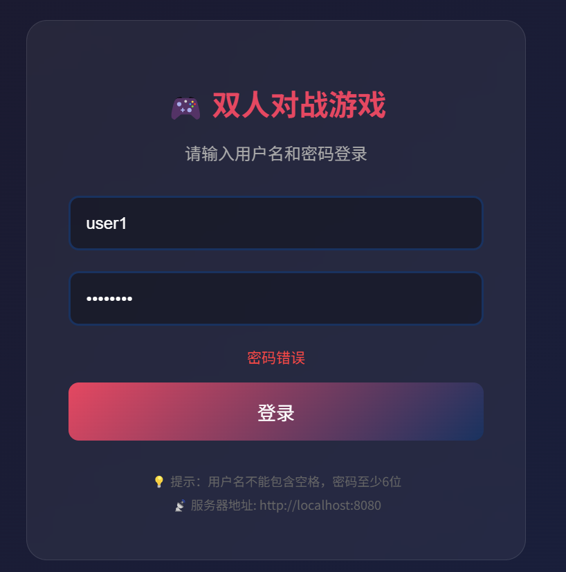
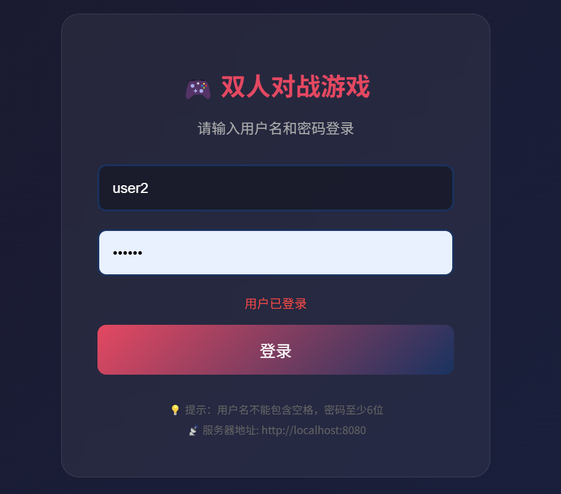

# FPS-GameServer
一个用于双人网络联机对战的H5小游戏
得分点
1. 在血量为 0 时能播放死亡动画，并发送结果给服务器记录 (包括
服务器端代码，及协议编写)。(5) √
2. 能同步血量；(5) √
3. 能以 2 秒每次的频率向服务器发送心跳协议；(5)√
3. 向服务器发送注册申请、用户名空格检查；(5) √
4. 已存在用户名的显示；(5) √
5. 登录：用户已登录的显示 (包括服务器端代码);(5) √
6. 登录：密码错误的显示 (包括服务器端代码);(5) √
7. 在原游戏项目的基础上添加房间系统场景及场景跳转；(5) √
8. 能接收服务器发来的房间列表；(5) √
9. 能用某种方式显示房间列表；(5) √
10. 能用某种方式选中某房间，并发送进入房间协议；(5) √
八、考察要求
11. 能接收服务器发来的开始游戏协议，并进入游戏；(5) √
12. 进入游戏后保持心跳协议的发送不停；(5) √
13. 能初始化两个 hero 的站位；(5) √
14. 能同步位置；(5) √
15. 能同步 hero 朝向；(5) √
16. 能同步开火；(5) √
17.Rocket 击中 hero 时能减少血量；(5) √
18.hero2 的血条跟随 (5) 
19. 以对称加密方式进行数据包的加密传输；(5) √
20. 以 Json 格式序列化和反序列化字符串协议；或用 Protobuff
格式编写应用层协议 (5, 加上 3 的 5 分) √

登录通过用户名检查密码，密码错误则提示错误

通过用户名检查是否已登录，已登录则提示已登录